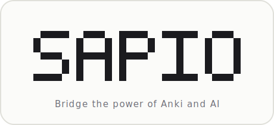

<p align="center">
  
</p>

# SAPIO

SAPIO est une application web qui tourne en local, basée sur Anki, et taillée
pour apprendre les maths en profondeur (prépa, licence, agrégation). Elle se
branche sur un LLM (Claude) grâce à ta propre clé API, dont l'usage est payant,
pour faire deux choses qu'Anki ne sait pas faire, à savoir générer tes cartes à
partir de ton cours et corriger tes copies manuscrites. Anki, lui, garde ce
qu'il fait de mieux, la planification des révisions.

## Pourquoi

Avec Anki tu peux déjà réviser par restitution active. Mais deux choses restent
à ta charge, et ce sont les plus ingrates.

1. **Fabriquer les cartes** à partir d'un poly de 200 pages (des heures à la main).
2. **Juger ta copie.** Anki ne lit pas ce que tu écris, il ne connaît que le
   bouton que tu presses. Donc tu t'auto-notes, toujours un peu trop indulgent.

## En pratique

1. **Générer les cartes.** Tu déposes ton poly (PDF). SAPIO y repère les objets
   de cours, à savoir les définitions, propositions, théorèmes, lemmes et
   exercices. Pour chacun il évalue l'importance (central, standard ou technique)
   et en dérive des cartes de restitution graduées, de la plus simple à la plus
   exigeante (énoncer, reformuler, donner un exemple, esquisser une idée de
   preuve, rédiger la démonstration complète). Tu ranges le tout par cours et
   chapitre, puis tu importes dans Anki.

2. **Réviser.** Tu révises comme à l'examen. Tu rédiges ta réponse sur papier de
   mémoire, tu la prends en photo, et SAPIO l'envoie à Claude via l'API
   d'Anthropic (payante). Claude transcrit ton manuscrit, le compare à l'attendu
   et te rend un feedback avec une note. Cette note alimente le bouton FSRS
   d'Anki, qui planifie la suite.

FSRS est l'algorithme de planification d'Anki, celui qui fait toute sa puissance.
Il décide quand revoir chaque carte pour que ça tienne durablement en mémoire, et
SAPIO se contente de lui donner une bien meilleure note en entrée.

## Ce que SAPIO ajoute à Anki

| | Anki seul | Avec SAPIO |
|---|---|---|
| **Création des cartes** | manuelle, fastidieuse | générée depuis le poly PDF |
| **Correction de ta réponse** | auto-évaluation (« je savais ») | ta copie lue et notée par l'IA contre l'attendu |
| **Planification** | FSRS | FSRS (inchangé) |
| **Synchro** | AnkiWeb | AnkiWeb (inchangé) |
| **Suivi** | statistiques Anki | bilan PDF par leçon |

L'interface est épurée et pensée pour le quotidien (une seule photo de ta copie
suffit). Tu peux lancer SAPIO en local sur ta machine, ou l'héberger sur un VPS
et y accéder via un tunnel Cloudflare. Dans tous les cas il ne remplace pas Anki,
il s'appuie dessus, et tes cartes restent dans ta collection, planifiées par FSRS
et synchronisées sur AnkiWeb.

## Architecture

Tout d'abord le **cœur** : la **bibliothèque officielle `anki`** (collection,
FSRS, synchro AnkiWeb). Pas besoin d'Anki desktop ni d'AnkiConnect, car SAPIO
ouvre directement ta collection `.anki2`. C'est, pour l'essentiel, un simple
serveur web.

Ensuite les couches.

1. **API** : Flask en JSON (`app/api.py`).
2. **Front** : une SPA React, Vite et TypeScript (`app/frontend/`), servie par
   Flask sur la même origine (donc pas de CORS).
3. **IA** : Anthropic (Claude) ou OpenRouter, avec **un modèle par étape**. Un
   modèle économique pour l'extraction (lecture d'imprimé), et un modèle de
   pointe pour la notation (jugement de rigueur sur un manuscrit).

Le package Python s'appelle `app`, et la commande CLI reste `sapio`.

> SAPIO importe la bibliothèque `anki`, sous **AGPL-3.0**. Par conséquent SAPIO
> est lui-même distribué sous **AGPL-3.0** (voir `LICENSE`).

## Prérequis

1. Python 3.10 ou plus.
2. Node 18 ou plus (pour le build du front).
3. `pdftoppm` et `pdfinfo` (paquet **poppler-utils**), pour le rendu des pages PDF.
4. `pdflatex` (**TeX Live**), pour le bilan PDF (facultatif).
5. Une collection Anki (`collection.anki2`). Sur un serveur neuf, tu peux
   l'amorcer par une première synchro descendante depuis AnkiWeb.

## Installation

```bash
git clone git@github.com:pleflohic/sapio.git && cd sapio
python3 -m venv .venv && . .venv/bin/activate
pip install -e .                  # ajoute ".[prod]" pour gunicorn

# Front :
cd app/frontend
npm install && npm run build      # produit app/frontend/dist/, servi par Flask
cd ../..
```

## Configuration

Il y a deux endroits bien distincts, avec deux rôles différents.

### 1. Secrets dans `.env` (à la main, jamais par le web)

Copie `.env.example` en `.env` (gitignoré).

```bash
ANTHROPIC_API_KEY=sk-ant-...
# OPENROUTER_API_KEY=sk-or-...        # si SAPIO_PROVIDER=openrouter
# ANKIWEB_USERNAME=...                # pour la synchro AnkiWeb
# ANKIWEB_PASSWORD=...
```

Par sécurité, les secrets ne sont jamais lisibles ni modifiables par HTTP. L'app
vérifie seulement leur présence (✓ ou ✗) dans l'onglet Paramètres.

### 2. Préférences dans l'onglet **Paramètres**, écrites dans `~/.config/sapio/settings.json`

On y trouve le provider, le modèle d'extraction, le modèle de notation, le DPI
et le **chemin de la collection**. Ces réglages sont modifiables depuis l'app et
appliqués à chaud. Le fichier est créé automatiquement (chmod 600, et tu peux
changer son emplacement avec `SAPIO_CONFIG_DIR`). Au premier lancement, les
valeurs sont amorcées depuis l'environnement et le `.env`, par souci de
compatibilité avec une installation existante.

> ⚠️ N'ouvre pas la même collection que l'app Anki desktop en même temps (ni
> pendant une synchro). Une seule poignée à la fois.

## Lancer

```bash
# Développement :
sapio serve                       # http://localhost:5000 (et accessible sur le LAN)

# Production :
gunicorn app.wsgi:app --bind 127.0.0.1:5000
```

Pour le rechargement à chaud du front pendant le dev, lance `npm run dev` dans
`app/frontend`.

### Le flux de révision, en trois temps (on ne note jamais une lecture non confirmée)

1. **Cartes du jour.** Tu choisis un deck, les cartes dues s'affichent
   numérotées. Tu rédiges tout sur papier (avec le numéro), puis tu déposes une
   ou plusieurs photos de l'ensemble.
2. **Vérification.** Claude transcrit chaque réponse en LaTeX (aperçu live et
   éditable). Tu corriges ce qui est mal lu, puis tu valides.
3. **Notation.** Claude note les transcriptions validées contre l'attendu, et
   rend un feedback ainsi qu'une note ajustable par carte. « Valider » envoie à
   FSRS, journalise la session et régénère le bilan PDF. Les cartes non traitées
   restent intactes.

### Créer des cartes

Dans l'onglet **Créer des cartes**, tu déposes un poly PDF. SAPIO en extrait les
objets de cours et génère les cartes, puis tu les ranges en
`Année › Cours › Chapitre › Partie` (l'Année et le Cours sont suggérés par
Claude, et tu choisis parmi les existants ou tu en crées de nouveaux), et enfin
tu importes.

## Synchro AnkiWeb

Renseigne `ANKIWEB_USERNAME` et `ANKIWEB_PASSWORD`. SAPIO synchronise alors au
démarrage et après chaque session (sinon, le bouton **↻ Sync** est là pour ça).
Une **synchro complète** (en cas de conflit) n'est jamais résolue
automatiquement, à cause du risque de perte de données. Il faut la déclencher
explicitement.

## ⚠️ Sécurité avant toute exposition publique

SAPIO n'a aucune authentification intégrée. Or l'endpoint `/api/generate`
**dépense ton crédit Claude**, et `/api/sync` touche ta collection. Par
conséquent, avant de l'exposer (par exemple via un tunnel Cloudflare), place
**toute l'app** derrière une couche d'authentification (par exemple **Cloudflare
Access**) et du **HTTPS**, et utilise une **clé Claude dédiée et plafonnée** pour
le serveur.

## CLI

Le serveur web reste l'interface recommandée, mais tout est aussi scriptable.

```bash
sapio extract poly.pdf --pages 8-15   # poly → objects.json, cards.json, decks.json
sapio push                            # crée le note type et les decks, ajoute les notes
sapio review                          # révision en terminal (une photo par carte)
sapio bilan                           # bilan PDF cumulatif depuis history.json
```

## Crédits et mentions légales

SAPIO s'appuie sur la **bibliothèque officielle Anki** (© Ankitects Pty Ltd),
distribuée sous AGPL-3.0 (<https://github.com/ankitects/anki>). C'est cette
dépendance qui impose à SAPIO la même licence.

« Anki » et « AnkiWeb » sont des marques d'Ankitects Pty Ltd. SAPIO est un projet
**indépendant**, sans affiliation ni soutien d'Ankitects.

SAPIO étant une application réseau, la **clause réseau de l'AGPL (§13)**
s'applique. Autrement dit, toute personne qui l'utilise à distance a le droit
d'en obtenir le code source correspondant. Garder le dépôt public (ou en
proposer le source aux utilisateurs) satisfait cette obligation.

## Licence

[GNU AGPL-3.0-or-later](LICENSE). Le code source de la dépendance Anki est
disponible sur <https://github.com/ankitects/anki>.
